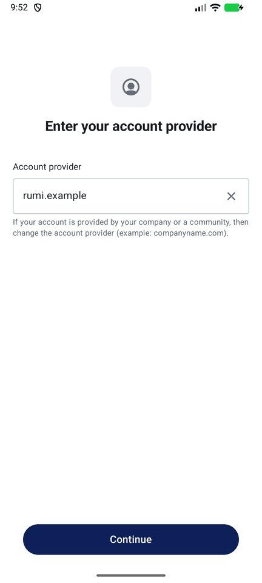
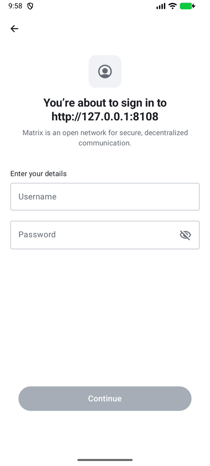
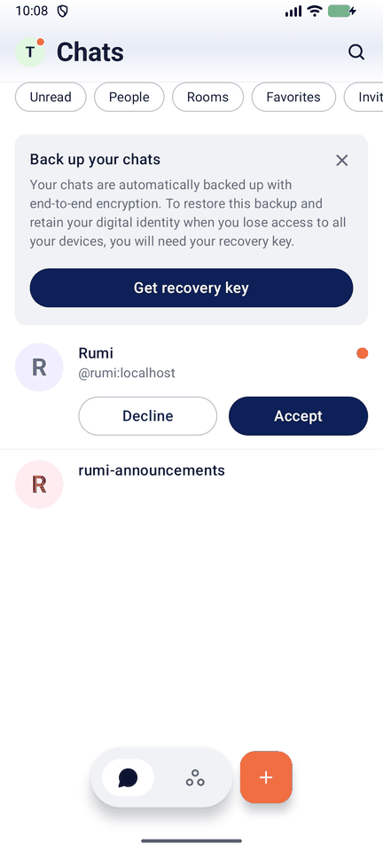
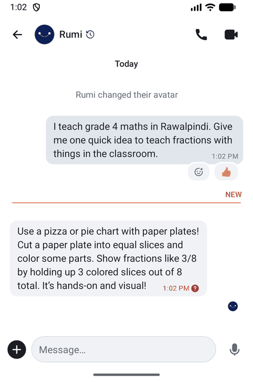
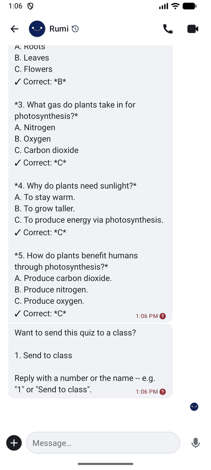
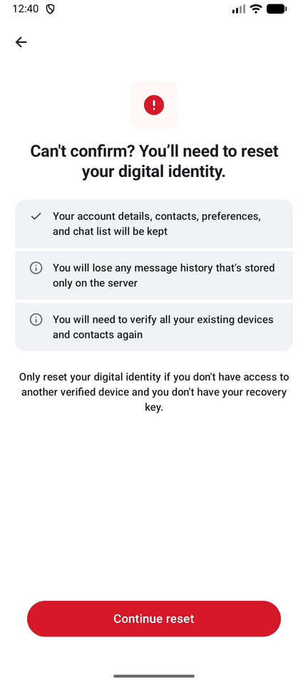

# Teacher guide

Rumi Messenger is a private chat app for your school. You can message and call colleagues, and
Rumi, your teaching companion, is inside it. You use Rumi the same way you use it on WhatsApp.

If you've used WhatsApp, most of this will feel familiar. This page covers everything a teacher needs. If something here doesn't match what you see, tell
your school's admin. They can [report it to us](https://github.com/Orenda-Project/rumi-messenger/issues).

## On this page

1. [What you need](#1-what-you-need)
2. [Get the app](#2-get-the-app)
3. [Sign in](#3-sign-in)
4. [Say hello to Rumi](#4-say-hello-to-rumi)
5. [What you can ask Rumi](#5-what-you-can-ask-rumi)
6. [Chat and call your colleagues](#6-chat-and-call-your-colleagues)
7. [Save your backup code (do this on day one)](#7-save-your-backup-code-do-this-on-day-one)
8. [Use a second phone or a computer](#8-use-a-second-phone-or-a-computer)
9. [What is private](#9-what-is-private)
10. [Something is wrong](#10-something-is-wrong)

## 1. What you need

Get these three things from your school's admin before you start:

| | Example | What it is |
|---|---|---|
| **Server address** | `https://chat.yourschool.org` | Your school's Rumi Messenger. Always type the `https://` (or `http://`) part. |
| **Username** | `+923001234567` | Your phone number with the `+` in front, no spaces or dashes. |
| **Password** | `4f9c1a0b7e2d6c3a9b8e1f00` | Your admin sets it. It's often a long mix of letters and numbers, so copy and paste it if you can. You can change it later in the web app, under **Settings**, then **Account**. |

You also need an internet connection. Wi-Fi and mobile data both work.

You don't sign up yourself, and you don't get an SMS code. Your admin creates your account and
sends you these three things privately, on paper or in a message. If you have no username or
password yet, ask your admin.

## 2. Get the app

**Android phone.** Download the Rumi Messenger app from
[github.com/Orenda-Project/element-x-android/releases/latest](https://github.com/Orenda-Project/element-x-android/releases/latest).
Scroll down to the list called **Assets**. It has a few files. Ignore the ones called **Source
code**. Tap the file whose name has `arm64-v8a` and ends in `.apk`, which is right for almost
every phone. If it won't install, go back and use the one with `universal` in its name instead.

Open the downloaded file from your notifications or your **Downloads** folder. Android then asks
whether to allow installing apps from your browser. Tap **Settings**, turn on **Allow from this
source**, go back and tap **Install**. The words differ a little between phone brands. If you get
stuck, ask your admin to do this step with you once. The app isn't in the Play Store yet.

> The app isn't in the Play Store yet; the release page above is the official download. If it
> won't install on your phone, use the web app below and tell your admin.

**iPhone.** There is no Rumi-branded iPhone app yet
([#13](https://github.com/Orenda-Project/rumi-messenger/issues/13)). You have two options. Use
the web app below in Safari. Or install **Element X** from the App Store and follow the same
sign-in steps. Element X is the free app ours is built on, so it works with your school's server.
We haven't tested it on an iPhone ourselves yet.

**Computer, or any phone with a browser.** Open your school's server address in Chrome, Firefox,
Edge or Safari, for example `https://chat.yourschool.org`. That's the web app, and there's
nothing to install.

## 3. Sign in

### In the Android app

1. Open the app and tap **Sign in manually**. Don't use **Sign in with QR code**.
2. The app asks for an **account provider**. Clear the example text and type your school's full
   server address, including `https://`.

   

   Always type the `https://` or `http://` part, exactly as your admin wrote it. If you forgot it
   and the app just shows a spinner, go back and type the address again with it.
3. Tap **Continue**. The app checks the address, which takes a couple of seconds. The next screen
   says "You're about to sign in to" and shows your server's address.
4. Type your **username** (`+923001234567`) and your **password**, then tap **Continue**.

   

   (This picture was taken on a test server. Yours shows your school's address.)

5. The app may ask about notifications. You can say yes or no. Rumi works the same way whatever
   you choose. If a box appears saying "No distributors available", tap OK and carry on: it means
   the **ntfy** app isn't set up yet (see "About notifications" in section 6). Messages still
   arrive whenever the app is open.

### In the web app

1. Open your school's server address in your browser.
2. Click **Sign in**. The server is already filled in, so there's nothing to type there.
3. Enter your username (`+923001234567`) and password, then click **Sign in**.

## 4. Say hello to Rumi

A few seconds after you first sign in, Rumi sends you a chat invitation. You'll also see a room
called **Rumi Announcements**, where your school shares updates.

1. On the chat list, find **Rumi** and tap **Accept**.

   

2. Rumi says hello: *"Hi, we're glad you're here. This is your space with Rumi. Ask us anything
   about your class, your lessons, or your day. You're not teaching alone."* If that first
   message shows as "Waiting for this message" instead, don't worry: it was sent before your
   phone existed. Just type your question; Rumi's reply to you will read normally.
3. Type your question and send it. Replies usually arrive within about 15 seconds.

In the web app, you can also click **Talk to Rumi** on the home page at any time.

## 5. What you can ask Rumi

Write to Rumi the way you would on WhatsApp, in your own words, in English or Urdu.

| You want | Try sending |
|---|---|
| An answer to any teaching question | "I teach grade 4 maths. Give me one quick idea to teach fractions with things in the classroom." |
| A quiz for your class | "Make a 5-question quiz on photosynthesis for grade 5" |
| A lesson plan | "Lesson plan for grade 3 English, topic: adjectives" |
| A lesson plan from a textbook page | Send a photo of the page (tap **+**, then choose a photo) |
| Feedback on your teaching (coaching) | Send an audio recording of your lesson |
| A student's reading level (reading assessment) | Send a voice note of the student reading aloud |
| Homework, a video on a topic, exam checking, attendance | Ask for it in words, for example "homework for grade 6 science chapter 2" |

**Where is +?** In a chat, **+** is the round button at the bottom left, next to the message box.
The microphone at the bottom right records a voice note: tap it to start, tap the stop button when
you're done, then tap send. (Unlike WhatsApp, you don't hold it down.)

**Menus are numbered.** On WhatsApp, Rumi sometimes shows buttons. Here, it shows a numbered
list instead. Reply with the number (for example `1`) or with the words.

**Rumi asks your name once.** After your first request, Rumi asks what to call you, just like on
WhatsApp.

**Some features depend on your school.** Each feature has to be switched on by whoever runs Rumi
for your school. If Rumi says it can't do something yet, tell your admin. Everyday questions and
quizzes are the parts we've tested in this app so far.

> **Coming:** we haven't yet tested lesson plans, photo lesson plans, coaching, reading
> assessments and voice notes end to end in this app. They use the same Rumi as WhatsApp, so they
> should work once your school switches them on. Lesson plans also need a service key we don't
> have yet ([#11](https://github.com/Orenda-Project/rumi-messenger/issues/11)).

## 6. Chat and call your colleagues

**Start a chat.** Tap **+** (Android) or **Start chat** (web). Then, under **Search for someone**, type the first letters of a
colleague's name, for example `Ay` for Ayesha Khan. Pick them from the list, then confirm on the
"Start a chat with this new contact?" box that appears; the chat opens after that. The search matches
the start of each word in a name, so `Kha` finds "Ayesha Khan" but `yesha` doesn't.

**Make a group.** Tap **+** and choose **New room**. Give it a name, such as "Grade 4 teachers",
and add colleagues by name.

**Rumi in a group.** Rumi isn't in a group until someone adds it. Invite **Rumi** by name, the
same way you add a colleague. After that, start your message with **@Rumi** (pick Rumi from the
list that appears) to ask something, for example "@Rumi one warm-up for grade 3 maths". You can
also reply to one of Rumi's messages. If Rumi sends a numbered list, just reply with the number.
Rumi doesn't respond to anything else, so the group stays a conversation between teachers.

**Send photos, files and voice notes.** In any chat, tap **+** for photos and files. Hold the
microphone to record a voice note.

**Call someone.** Open a one-to-one chat. The phone and camera buttons at the top start a voice
or video call. On the web your colleague sees **Incoming voice call**, then **Join**. The first
video call asks to use your camera: tap **While using the app**. To hang up, tap the red button.
Each call stays in the chat as a **Call started** line (on the web: **Voice call** / **Video call**);
a call you missed looks the same, there is no separate "missed call" line yet. Calls from the web to
the phone ring only when notifications are set up (see "About notifications" below).

> **Not yet proven:** calls between two different buildings or networks, and on real phones
> (we tested on one server with an Android emulator). If a call connects but you can't hear
> anything, tell your admin.

About notifications:

To get notifications while Rumi is closed, your phone needs one more free app, **ntfy**. Do this
once, when your admin gives you the ntfy address:

1. Install **ntfy** (from F-Droid, or the link your admin sends). Allow its notifications, and tap
   **Allow** when it asks to run in the background.
2. In ntfy, tap the menu (three dots), then **Settings**, then **Default server**. Type the
   address your admin gave you (it starts `https://ntfy.`) and tap **Save**. Do this *before*
   opening Rumi.
3. Open Rumi. The "No distributors available" box no longer appears.

> **Coming: notifications when the app is closed.** Your admin is still finishing this on the
> server ([#3](https://github.com/Orenda-Project/rumi-messenger/issues/3)). Until they say it's
> on, open the app a few times a day, or keep the web app open in a browser tab.

## 7. Save your backup code (do this on day one)

Your messages are locked with keys that only live on your own devices. The **backup code** is a
long code that opens your old messages on a new phone. Without it, a new phone can't read your
earlier chats. (App versions up to v0.1.1 call it the **recovery key**. It's the same thing.)

1. At the top of the chat list, the app shows **Save your backup code**. Tap **Get backup code**.
   (Or go to **Settings**, then **Encryption**.)
2. The app shows a code. Write it on paper, or save it somewhere private that isn't this phone.
3. Don't share it. Your admin doesn't have it and can't get it back for you.

## 8. Use a second phone or a computer

You can be signed in on your phone and on a computer at the same time. Adding a device is where
most problems happen, so follow these steps in this order:

1. **Keep your first device open and signed in.**
2. Sign in on the new device ([section 3](#3-sign-in)).
3. The new device shows **Confirm it's you**. Choose one of these:
   - **Approve on my other phone**: your first phone or computer shows a prompt. Approve it there.
   - **Enter my backup code**: type the code from [section 7](#7-save-your-backup-code-do-this-on-day-one).
4. When the new device says it's confirmed, you're done. Your old messages appear on it.

**If you see "Can't confirm? You can start fresh.", stop.**

Don't tap **Start fresh** unless you've truly lost your backup code and every other device.
Starting fresh keeps your account and chat list. But every message you had before shows up as
"Waiting for this message" and never opens. Go back, open your first device, or find your
backup code, and try again. (App versions up to v0.1.1 word this screen as "reset your digital
identity", with a **Continue reset** button, as in the picture.)

**Your messages always send.** An old phone or a half-finished sign-in left on your account no
longer stops your messages. You don't need to fix anything first.

**Signing out of an old phone.** When you stop using a device, sign out of it (**Settings**, then
**Sign out**), or ask your admin to remove it. A device left signed in can still receive your new
messages, so never leave one signed in on a phone you've given away.

## 9. What is private

- **Your chats with colleagues and with Rumi are end-to-end encrypted.** Only the people in the
  chat can read them. Your school's server stores them locked, and your admin can't read them.
- **Rumi reads the messages you send to Rumi.** That's how it answers you. Your school's Rumi
  service keeps a record of those conversations, as it does on WhatsApp.
- **The Rumi Announcements room isn't encrypted.** Anyone at your school can read it. Don't post
  private things there.
- **Everyone on your school's server can find you by name.** People outside your school can't
  message you. This server doesn't connect to other servers.
- **The app never uploads your phone's contacts.**

## 10. Something is wrong

| What you see | What to do |
|---|---|
| A spinner that never stops after you type the server address | Check that you typed `https://` or `http://` at the start, then try again. If you can, copy the address exactly as your admin sent it. |
| "Invalid username or password" | Type the username with the `+` and no spaces: `+923001234567`. Passwords are case-sensitive. If it still fails, ask your admin to reset your password. There's no "forgot password" email. |
| A message has a red mark and says "Message not sent because you have not verified one or more of your devices" | Only app versions up to v0.1.1 do this. Install the newer app from your admin's link. Until then: press and hold the message, open the details, and tap **Send message anyway**, and tell your admin so they can remove your old sign-ins. |
| You don't see a Rumi chat at all | Wait a minute, then pull the chat list down to refresh it. If Rumi still isn't there, tell your admin: the Rumi service may not be connected to your school's server yet. You can still chat with colleagues in the meantime. |
| Rumi doesn't reply | Wait a minute, then send your message again. If Rumi still doesn't answer, tell your admin, because the Rumi service may be stopped. |
| Rumi says it can't do something | Your school may not have switched that feature on yet. Tell your admin. |
| Old messages show "Waiting for this message" | This device can't open them yet. Confirm it with your backup code or another device ([section 8](#8-use-a-second-phone-or-a-computer)). If you chose **Start fresh** earlier, those messages can't be recovered. |
| A call connects, but there's no sound or picture | Your network may block calls, or the server isn't set up for calls between networks yet. Tell your admin. |
| No notification for a new message | Check ntfy is installed and its Default server is your school's ntfy address ([section 6](#6-chat-and-call-your-colleagues)). Until your admin says notifications are on, this is expected while the app is closed. Open the app to check. |
| You can't find a colleague | Type the start of their first or last name. If they still don't appear, their account may not exist yet. Ask your admin. |

Still stuck? Your school's admin is your first contact. They can check the server and
[ask us](https://github.com/Orenda-Project/rumi-messenger/issues).
